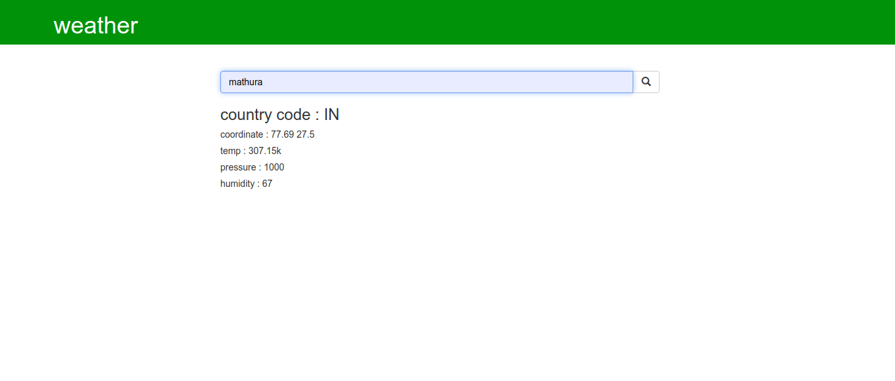

# weather-django

we will learn how to create a Weather app that uses Django as backend. Django provides a Python Web framework based web framework that allows rapid development and clean, pragmatic design.

# Weather-app
